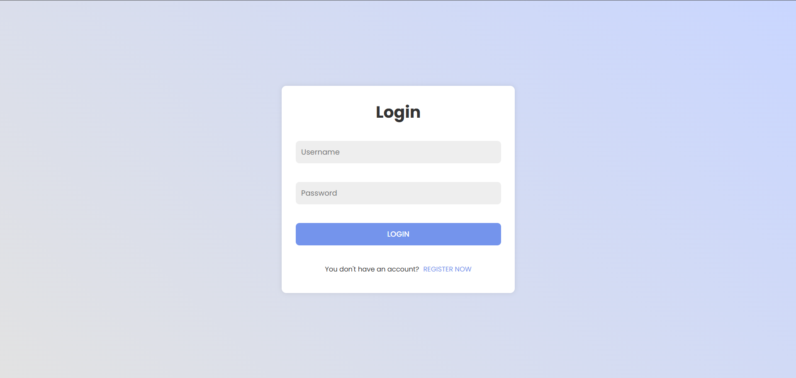
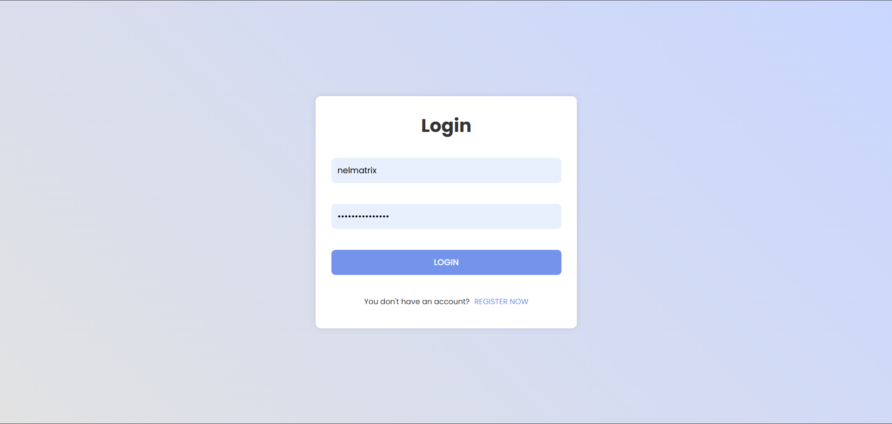
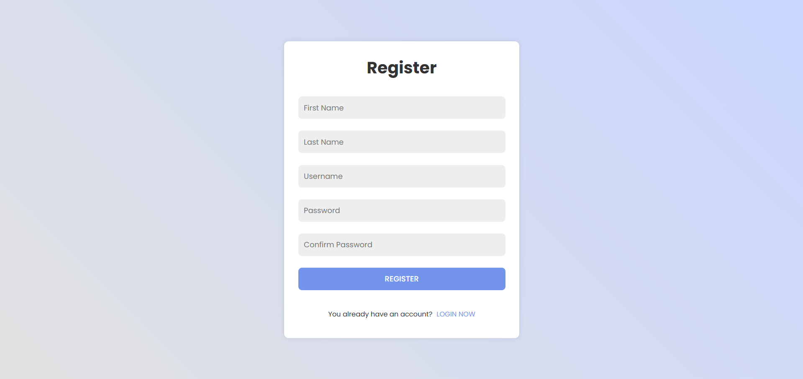

# PAPAYA PLATFORM

A simple web platform that offers user registration, user login, and a home page. I built this project to improve my knowledge, understanding, and skills in implementing authentication and registration for user accounts domain in Django apps.  

With this project, I learnt how to implement Function-based login, logout, and registration views from scratch, using the built-in User model.

---
 

  

  

---
MIT LICENSE  

---